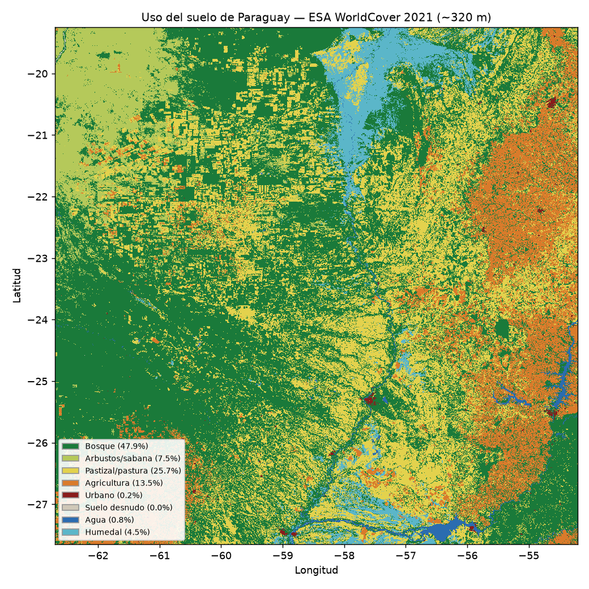

La agricultura y la ganadería son el **medio de vida** de cientos de miles de
familias paraguayas y, a la vez, el eje de la economía exportadora. Pero **no todas
las escalas están igual de expuestas** a las amenazas: la misma sequía o inundación
que el agronegocio absorbe con capital, riego y seguros puede **liquidar** a la
agricultura familiar y a la ganadería de subsistencia. Analizar el agro "en todas sus
escalas" es, por eso, analizar cómo se **construye socialmente** la vulnerabilidad.

::: {.callout-important}
## El dato en disputa
Las cifras del **Censo Agropecuario Nacional 2022 (CAN 2022)** son la fuente
principal, pero sus resultados fueron **cuestionados públicamente** por
organizaciones campesinas y de investigación (Heñói, BASE-IS) por inconsistencias y
demoras [@henoi_can2022]. La *producción del dato* estadístico es, en sí, un terreno
en disputa —algo que un enfoque crítico del riesgo no puede ignorar—.
:::

## Estructura agraria: muchas fincas, poca tierra

El CAN 2022 relevó **291.497 fincas productivas** sobre **30,4 millones de hectáreas**
[oficial]{.badge-oficial} [@can2022]. Su distribución revela una estructura
**bimodal** —una masa de fincas campesinas y una élite latifundista—:

| Escala | Fincas | Tierra |
|---|---|---|
| **Agricultura familiar** (89% de las fincas) | ~259.188 | ~2,5 millones de ha (~8%) |
| **Gran propiedad** (0,07% de propietarios) | ~182 | >12 millones de ha (~40%) |

: La agricultura familiar es **el 89 % de las fincas** pero ocupa **~8 % de la tierra**; en el otro extremo, **182 propietarios** controlan ~40 % de la superficie [@marketdata_af2022; @pereira_solis2024].

El **índice de Gini de la tierra es 0,97** —una de las distribuciones más desiguales
del mundo, prácticamente sin cambios entre 2008 y 2022— [académico]{.badge-academico}
[@pereira_solis2024]. El **38 %** de las fincas familiares están encabezadas por
**mujeres** [@marketdata_af2022]. Entre censos, cuatro rubros de exportación (soja,
trigo, maíz, arroz) pasaron de ocupar el 84 % al **93 %** de la superficie cultivada,
desplazando a los cultivos de autoconsumo [@pereira_solis2024].

::: {.callout-note appearance="minimal"}
**La distribución de la tierra es, en sí, un factor de riesgo construido:** sin tierra
suficiente ni reservas, la finca campesina no tiene margen para absorber un mal año.
:::

## Agricultura por rubro y escala

**El agronegocio (exportación).** La **soja** es el cultivo insignia: ~**3,6 millones
de ha** y ~**10 millones de toneladas** en la zafra 2024/25, con un complejo sojero que
exportó **USD 3.571 millones** en 2025 [gremial]{.badge-prensa} [@capeco_soja2026].
Se concentra en Alto Paraná, Itapúa, Canindeyú y Caaguazú (>87 % en cinco
departamentos). El **arroz con riego** creció a **266.327 ha** (+41 % en un año)
—un rubro intensivo en agua, en conflicto directo con Ñeembucú (ver más abajo)—.

**La agricultura familiar (alimento).** Las ~259.188 fincas familiares producen
**mandioca, poroto, sésamo, horticultura** y autoconsumo, y son la base de la
**seguridad alimentaria** interna. Su vulnerabilidad es estructural
[académico]{.badge-academico} [@cadep_afc2022]: el **algodón**, que fue su principal
rubro de renta, colapsó, y su reemplazo (sésamo) es volátil. El desplazamiento de
alimentos por monocultivo de exportación es una **decisión político-económica**, no un
dato natural [@henoi_can2022].

## Ganadería en todas sus escalas

El **hato bovino nacional** ronda los **13 millones de cabezas** (13,22 M en el CAN
2022; ~12,8 M en 2025 tras la sequía) [oficial]{.badge-oficial} [@can2022]. Coexisten
**dos ganaderías**:

| | Región Oriental | Chaco (Occidental) |
|---|---|---|
| **Hato (2025)** | ~7 M (54,6%) | ~5,82 M (45,4%) |
| **Perfil** | mixto; incluye pequeña ganadería familiar | grandes estancias exportadoras |

: El Chaco, con pocas y enormes explotaciones, se acerca al liderazgo ganadero [@valoragro_bovino2025].

La **concentración** también marca la ganadería: hay **~116.224 tenedores** de bovinos,
pero **~3 % de los establecimientos genera ~61 % de la producción**, mientras
**>122.000 productores tienen menos de 20 cabezas** (ganadería de ahorro, leche y
autoconsumo) [prensa]{.badge-prensa} [@uh_ganaderia2024]. La **exportación de carne**
alcanzó **355.744 t y ~USD 2.130 millones en 2025** [prensa]{.badge-prensa}
[@forbes_carne2025] —un récord que convive con la crisis de los pequeños criadores—.

## La huella espacial del agro: uso del suelo

El uso del suelo hace **visible la geografía de las escalas**. Este mapa (ESA
WorldCover 2021, analizado a ~320 m) muestra dónde está cada cosa:



```{python}
#| echo: false
import json
from IPython.display import Markdown
d = json.load(open("datos/exposicion/uso_suelo_resumen.json", encoding="utf-8"))
p = d["pct_nacional"]
Markdown("| Cobertura | % del país |\n|---|---:|\n" +
         "\n".join(f"| {k} | {v} % |" for k, v in p.items()))
```

- **El este agrícola:** la franja naranja del oriente es el **cinturón sojero**
  (Alto Paraná, Itapúa, Canindeyú) —el agronegocio de exportación—.
- **El Chaco de pastura:** los bloques amarillos tallados en el verde del bosque son la
  **ganadería** avanzando sobre el Chaco (ver deforestación más abajo).
- **Bosque y humedal:** el bosque aún cubre cerca de la mitad del país —coherente con el
  **44,4 %** que reporta el INFONA [@infona_forestal2024]— y el Pantanal aporta el
  humedal del norte.

Agricultura y pastura suman en torno al **39 %** del territorio. El mapa muestra que las
dos escalas del agro no solo difieren en tamaño, sino en **geografía**: soja al este,
ganadería al oeste [@esa_worldcover].

## Exposición diferencial a las amenazas

*La misma amenaza golpea distinto según la escala.* Este es el nexo con los módulos de
amenaza del sitio:

- **[Inundación](../amenazas/inundacion-fluvial/index.qmd):** las crecidas anegan cultivos y ganado
  en Ñeembucú, Central y el Chaco (abril de 2026, miles de vacunos en el agua). Un caso
  de **riesgo construido**: productores atribuyen la "**inundación artificial**" a los
  **terraplenes y el represamiento de cauces por grandes arroceras** —el pequeño
  productor absorbe el costo de una infraestructura del agronegocio—
  [prensa]{.badge-prensa} [@abc_neembucu_arroceras2025; @cta_riadas2025].
- **[Sequía / bajante](../amenazas/sequia/index.qmd):** la zafra **2021/22** fue la peor
  de la historia (pérdidas ~**USD 3.000 millones**) [@lanacion_agro2022]; la sequía de
  **2024** obligó a **trasladar >40.000 cabezas** en el Chaco, con mortandad y preñeces
  por debajo del 50 % [prensa]{.badge-prensa} [@lapolitica_sequia_chaco2024].
- **[Heladas](../amenazas/frio/index.qmd):** dañan trigo, maíz, horticultura y pasturas
  del sur; la horticultura **bajo invernadero** resiste mejor —la brecha tecnológica es
  brecha de vulnerabilidad—.
- **[Incendios](../amenazas/incendios/index.qmd):** en 2024 el fuego arrasó
  **>350.000 ha**, con fuerte impacto en campos ganaderos del Chaco y el Pantanal.

::: {.callout-important}
## La deforestación como amenaza que se fabrica
La expansión ganadera transformó **~4,37 millones de ha de bosque del Chaco entre 2005
y 2020** (~90 % de la deforestación nacional) [@baseis_chaco2024]; la cobertura forestal
del país cerró 2024 en **44,4 %** [@infona_forestal2024]. Esa deforestación **produce**
más sequía, más fuego y alteración hidrológica —la amenaza no es solo "natural": se
construye—, y luego se distribuye de forma desigual.
:::

## Síntesis: vulnerabilidad diferencial

El **agronegocio** absorbe mejor el golpe (capital, riego, movilidad de la hacienda,
diversificación de mercados, seguros); la **agricultura familiar** y la **ganadería de
subsistencia** quedan expuestas sin cobertura. El desastre agropecuario no es una
fatalidad climática: es el resultado de una **estructura agraria desigual** que decide,
de antemano, quién resiste y quién pierde todo.

## Datos abiertos y vacíos

Para mapear el uso del suelo agropecuario y su cambio hay datos abiertos:
**MapBiomas Paraguay** (cobertura 1985-2024 por departamento, incluye fuego)
[@mapbiomas_py] e **INFONA** (cobertura forestal) [@infona_forestal2024]; el dataset del
**CAN 2022** está en datos.gov.py.

::: {.vacio}
Pendiente de fuente primaria única: series 2020-2025 por rubro de la agricultura
familiar (mandioca, poroto, sésamo) desagregadas por departamento; caña de azúcar
2024-2025; cuantificación monetaria de las pérdidas por heladas; y el origen preciso del
dato "la AF provee ~85 % de la canasta básica" (circula sin cita primaria localizable).
Conviene, además, descargar el reporte primario del **MAG-DCEA** y citar tabla y página.
:::
